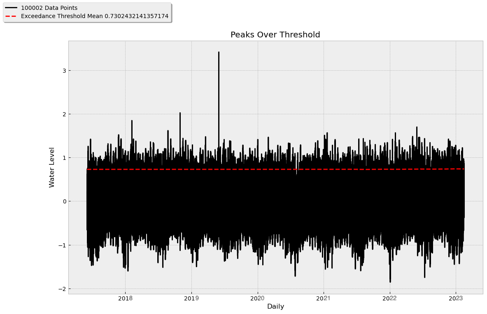
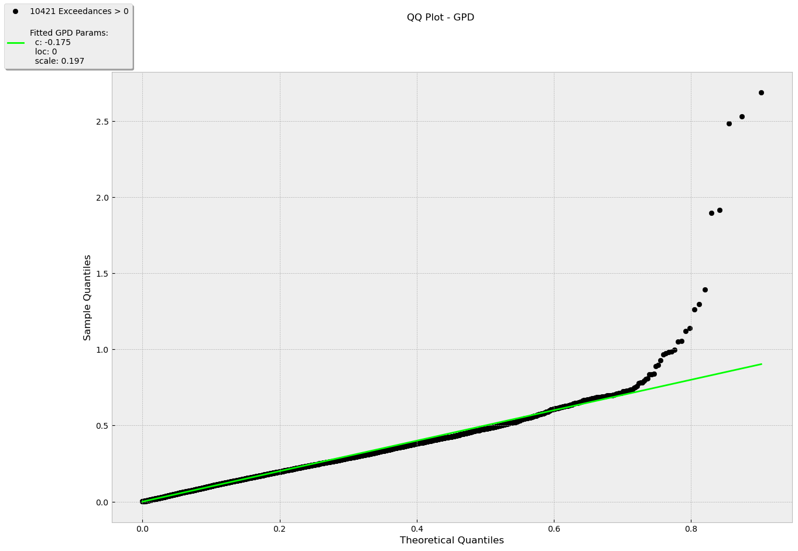

<h1 align=center><strong>Anomalytics</strong></h1>

<h3 align=center><i>Your Ultimate Anomaly Detection & Analytics Tool</i></h3>

<p align="center">
    <a href="https://app.codecov.io/gh/Aeternalis-Ingenium/anomalytics/tree/trunk" >
        
    </a>
    <a href="https://results.pre-commit.ci/latest/github/Aeternalis-Ingenium/anomalytics/trunk">
        
    </a>
    <a href="https://github.com/psf/black">
        
    </a>
    <a href="https://pycqa.github.io/isort/">
        
    </a>
    <a href="#">
        
    </a>
    <a href="https://github.com/Aeternalis-Ingenium/anomalytics/actions/workflows/build.yaml">
        
    </a>
    <a href="https://github.com/Aeternalis-Ingenium/anomalytics/actions/workflows/code-quality.yaml">
        
    </a>
    <a href="https://github.com/Aeternalis-Ingenium/anomalytics/actions/workflows/test.yaml">
        
    </a>
    <a href="https://github.com/Aeternalis-Ingenium/anomalytics/blob/trunk/LICENSE">
        
    </a>
    <!-- Replace the '#' in the href with your documentation link -->
    <a href="#">
        
    </a>
    <!-- Replace the '#' in the href with your PyPi package link -->
    <a href="#">
        
    </a>
</p>

## Introduction

`anomalytics` is a Python library that aims to implement all statistical method for the purpose of dtecting any sort of anomaly e.g. extreme events, high or low anomalies, etc. This library utilises external dependencies such as:

- [Pandas 2.1.1](https://pandas.pydata.org/)
- [NumPy 1.26.0](https://numpy.org/)
- [SciPy 1.11.3](https://scipy.org/)
- [Matplotlib 3.8.2](https://matplotlib.org/)
- [Pytest-Cov 4.1.0.](https://pytest-cov.readthedocs.io/en/latest/)
- [Black 23.10.0](https://black.readthedocs.io/en/stable/)
- [Isort 5.12.0](https://pycqa.github.io/isort/)
- [MyPy 1.6.1](https://mypy.readthedocs.io/en/stable/)
- [Bandit 1.7.5](https://bandit.readthedocs.io/en/latest/)

`anomalytics` supports the following Python's versions: `3.10.x`, `3.11.x`, `3.12.0`.

## Installation

To use the library, you can install as follow:

```shell
# Install without openpyxl
$ pip3 install anomalytics

# Install with openpyxl
$ pip3 install "anomalytics[extra]"
```

As a contributor/collaborator, you may want to consider installing all external dependencies for development purposes:

```shell
# Install bandit, black, isort, mypy, openpyxl, pre-commit, and pytest-cov
$ pip3 install "anomalytics[codequality,docs,security,testcov,extra]"
```

## Use Case

`anomalytics` can be used to analyze anomalies in your dataset (both as `pandas.DataFrame` or `pandas.Series`). To start, let's follow along with this minimum example where we want to detect extremely high anomalies in our time series dataset.

### Anomaly Detection via the `Detector` Instance

1. Import `anomalytics` and initialise your time series:

    ```python
    import anomalytics as atics

    ts = atics.read_ts("./my_dataset.csv", "csv")
    ts.head()
    ```
    ```shell
    Date-Time
    2021-11-03 08:00:00   -0.282
    2021-11-03 09:00:00   -0.368
    2021-11-03 10:00:00   -0.400
    2021-11-03 11:00:00   -0.320
    2021-11-03 12:00:00   -0.155
    Name: Example Dataset, dtype: float64
    ```

2. Initialize the needed detector object. Each detector utilises a different statistical method to detect the anomalies. In this example, we'll use POT method and a high anomaly type. Pay attention to the time period that is directly created where the `t2` is 1 by default because "real-time" always targets the "now" period hence 1 (sec, min, hour, day, week, month, etc.):

    ```python
    pot_detector = atics.get_detector("POT", ts, "high")

    print(f"T0: {pot_detector.t0}")
    print(f"T1: {pot_detector.t1}")
    print(f"T2: {pot_detector.t2}")
    ```
    ```shell
    T0: 70000
    T1: 19999
    T2: 1
    ```

3. The purpose of having a detector object is to support dividing the time windows between `t0`, `t1`, and `t2` because this is a big factor to extract exceedances. In case users want to customize their time window, they can call the `reset_time_window()` where users can now set t2 greater than 1 as well even though that will beat the purpose of the detector object. Pay attention to the period parameters because the method expects a percentage representation of the distribution of period (ranging 0.0 to 1.0):

    ```python
    pot_detector.reset_time_window(
        "historical",
        t0_pct=0.7,
        t1_pct=0.2,
        t2_pct=0.1,
    )

    print(f"T0: {pot_detector.t0}")
    print(f"T1: {pot_detector.t1}")
    print(f"T2: {pot_detector.t2}")
    ```
    ```shell
    T0: 70000
    T1: 20000
    T2: 10000
    ```

4. Let's extract exceedances by giving the expected `q`uantile:

    ```python
    pot_detector.get_extremes(0.95)
    pot_detector.exeedances.head()
    ```
    ```shell
    Date-Time
    2022-03-31 19:00:00    0.867
    2022-03-31 20:00:00    0.867
    2022-03-31 21:00:00    0.867
    2022-03-31 22:00:00    0.867
    2022-03-31 23:00:00    0.867
    Name: Example Dataset, dtype: float64
    ```

5. Let's visualize the exceedances and its threshold to have a clearer understanding of our dataset:

    ```python
    pot_detector.plot(plot_type="l+eth", title=f"Peaks Over Threshold", xlabel="Daily", ylabel="Water Level", alpha=1.0)
    ```

    

6. Compute the anomaly score:

    ```python
    pot_detector.fit()
    pot_detector.fit_result.head()
    ```
    ```shell
    Date-Time
    2022-10-29 00:00:00    0.0
    2022-10-29 01:00:00    0.0
    2022-10-29 02:00:00    0.0
    2022-10-29 03:00:00    0.0
    2022-10-29 04:00:00    0.0
    Name: Example Dataset, dtype: float64
    ...
    ```

7. The parameters are now stored inside the detector class:

    ```python
    pot_detector.params
    ```
    ```shell
    {0: {'datetime': Timestamp('2022-10-29 03:00:00'),
    'c': 0.0,
    'loc': 0.0,
    'scale': 0.0,
    'p_value': 0.0,
    'anomaly_score': 0.0},
    1: {'datetime': Timestamp('2022-10-29 04:00:00'),
    'c': 0.324456778899,
    'loc': 0,
    'scale': 0.19125308567629334,
    'p_value': 0.19286132173263668,
    'anomaly_score': 5.1850728337654886},
    ...}
    ```

8. Detect the extremely high anomalies:

    ```python
    pot_detector.detect(0.90)
    pot_detector.detection_result.head()
    ```
    ```shell
    Date-Time
    2023-02-09 08:00:00    False
    2023-02-09 09:00:00    False
    2023-02-09 10:00:00    False
    2023-02-09 11:00:00    False
    2023-02-09 12:00:00    False
    Name: Example Dataset, dtype: bool
    ```

9.  Evaluate your analysis result with Kolmogorov Smirnov 1 sample test:

    ```python
    pot_detector.evaluate("ks")
    pot_detector.evaluation_result.head()
    ```
    ```shell
        total_nonzero_exceedances	stats_distance	p_value	       c    loc     scale
    0	                     5028	        0.0284	 0.8987 0.003566	  0	 0.140657
    ```

10. We can also visually test our analysis result with "Quantile-Quantile Plot" method:

    ```python
    pot_detector.evaluate("qq")
    ```

    

### Anomaly Detection via Standalone Functions

1. Import `anomalytics` and initialise your time series:

    ```python
    import anomalytics as atics

    ts = atics.read_ts(
        "water_level.csv",
        "csv"
    )
    ts.head()
    ```
    ```shell
    Date-Time
    2021-11-03 08:00:00   -0.282
    2021-11-03 09:00:00   -0.368
    2021-11-03 10:00:00   -0.400
    2021-11-03 11:00:00   -0.320
    2021-11-03 12:00:00   -0.155
    Name: Example Dataset, dtype: float64
    ```

2. Set the time windows of t0, t1, and t2 to compute dynamic expanding period for calculating the threshold via quantile:

    ```python
    t0, t1, t2 = atics.set_time_window(ts.shape[0], "POT", "historical", t0_pct=0.7, t1_pct=0.2, t2_pct=0.1)

    print(f"T0: {t0}")
    print(f"T1: {t1}")
    print(f"T2: {t2}")
    ```
    ```shell
    T0: 70000
    T1: 20000
    T2: 10000
    ```

3. Extract exceedances and indicate that it is a `"high"` anomaly type and what's the `q`uantile:

    ```python
    exceedances = atics.get_exceedance_peaks_over_threshold(ts, ts.shape[0], "high", 0.95)
    exceedances.head()
    ```
    ```shell
    Date-Time
    2022-03-31 19:00:00    0.867
    2022-03-31 20:00:00    0.867
    2022-03-31 21:00:00    0.867
    2022-03-31 22:00:00    0.867
    2022-03-31 23:00:00    0.867
    Name: Example Dataset, dtype: float64
    ```

4. Compute the anomaly score for each exceedance and initialize a params for further analysis and evaluation:

    ```python
    params = {}
    anomaly_scores = atics.get_anomaly_score(exceedance_ts, exceedance_ts.shape[0], params)
    anomaly_scores.head()
    ```
    ```shell
    Date-Time
    2022-10-29 00:00:00    0.0
    2022-10-29 01:00:00    0.0
    2022-10-29 02:00:00    0.0
    2022-10-29 03:00:00    0.0
    2022-10-29 04:00:00    0.0
    Name: Example Dataset, dtype: float64
    ...
    ```

5. Inspect the parameters (the result of genpareto fitting):

    ```python
    params
    ```
    ```shell
    {0: {'datetime': Timestamp('2022-10-29 03:00:00'),
    'c': 0.0,
    'loc': 0.0,
    'scale': 0.0,
    'p_value': 0.0,
    'anomaly_score': 0.0},
    1: {'datetime': Timestamp('2022-10-29 04:00:00'),
    'c': 0.324456778899,
    'loc': 0,
    'scale': 0.19125308567629334,
    'p_value': 0.19286132173263668,
    'anomaly_score': 5.1850728337654886},
    ...}
    ```

6. Detect the extremely high anomalies:

    ```python
    detected_data = atics.detect(anomaly_score_ts, t1, 0.90)
    detected_data.head()
    ```
    ```shell
    Date-Time
    2023-02-09 08:00:00    False
    2023-02-09 09:00:00    False
    2023-02-09 10:00:00    False
    2023-02-09 11:00:00    False
    2023-02-09 12:00:00    False
    Name: Example Dataset, dtype: bool
    ```

7. Evaluate your analysis result with Kolmogorov Smirnov 1 sample test:

    ```python
    ks_result = atics.evals.ks_1sample(ts=exceedance, stats_method="POT", fit_params=params)
    print(ks_result)
    ```
    ```shell
    {'total_nonzero_exceedances': 5028, 'stats_distance': 0.0284, 'p_value': 0.8987, 'c': 0.003566, 'loc': 0, 'scale': 0.140657}
    ```

### Sending Anomaly Notification

Users can choose to send notification via E-Mail or Slack. These example will show both (please read the comments 😎):

1. Initialize the wanted platform:

    ```python
    # Gmail
    gmail = atics.get_notification(
        platform="email",
        sender_address="my-cool-email@gmail.com",
        password="AIUEA13",
        recipient_addresses=["my-recipient-1@gmail.com", "my-recipient-2@web.de"],
        smtp_host="smtp.gmail.com",
        smtp_port=876,
    )

    # Slack
    slack = atics.get_notification(
        platform="slack",
        webhook_url="https://slack.com/my-slack/1234567890/09876543/213647890",
    )

    print(gmail)
    print(slack)
    ```
    ```shell
    'Email Notification'
    'Slack Notification'
    ```

2. Prepare the data for the notification. For the standalone analysis, please use exatly the same column names (keys in `data`)!

    ```python
    # Standalone
    detected_anomalies = detected_data[detected_data.values == True]
    anomalous_data = ts[detected_anomalies.index]
    data = dict(
        row=[ts.index.get_loc(index) + 1 for index in anomalous.index],
        datetime=[index for index in anomalous.index],
        anomalous_data=[data for data in anomalous.values],
        anomaly_score=[score for score in anomaly_score[anomalous.index].values],
        anomaly_threshold=[anomaly_threshold] * anomalous.shape[0],
    )
    detection_summary = pd.DataFrame(data=data)


    # Detector Instance
    detection_summary = pot_detector.detection_summary

    # Both ways provide the exact same result! Trust me it's tested 😋
    detection_summary.head()
    ```
    ```shell
            row                 datetime    anomalous_data       anomaly_score  anomaly_threshold
    0       709      2023-11-10 08:00:00           15.1850  5.1850728337654881               5.05
    1       715      2023-11-16 09:00:00           16.7245  6.1850728337654883               5.05
    2       899      2023-11-25 09:00:00           16.9332  6.5245252131234522               5.05
    3       905      2023-11-29 11:00:00           15.2343  5.2952852731624753               5.05
    4       999      2023-11-30 12:00:00           18.2341  8.7246517285291231               5.05
    ```

3. Prepare the notification payload and a custome message if needed:

    ```python
    # Email
    gmail.setup(
        detection_summary,
        "Attention, detected anomaly from dataset Water Level:"
    )

    # Slack
    slack.setup(
        detection_summary,
        "Attention, detected anomaly from dataset Water Level:"
    )
    ```

4. Send your notification! Beware that the scheduling is not implemented since it always depends on the logic of the use case:

    ```python
    # Email
    gmail.send

    # Slack
    slack.send
    ```

5. The above example will produce the following notification:

> 🤖 Anomalytics - Anomaly Detected!
>
>
> Attention, detected anomaly from dataset Water Level:
>
>
> Row: 999 | Date: 2023-11-30 12:00:00 | Anomalous Data: 18.2341 | Anomaly Score: 8.7246517285291231 | Anomaly Threshold: 5.05


# Reference

* Nakamura, C. (2021, July 13). On Choice of Hyper-parameter in Extreme Value Theory Based on Machine Learning Techniques. arXiv:2107.06074 [cs.LG]. https://doi.org/10.48550/arXiv.2107.06074

* Davis, N., Raina, G., & Jagannathan, K. (2019). LSTM-Based Anomaly Detection: Detection Rules from Extreme Value Theory. In Proceedings of the EPIA Conference on Artificial Intelligence 2019. https://doi.org/10.48550/arXiv.1909.06041

* Arian, H., Poorvasei, H., Sharifi, A., & Zamani, S. (2020, November 13). The Uncertain Shape of Grey Swans: Extreme Value Theory with Uncertain Threshold. arXiv:2011.06693v1 [econ.GN]. https://doi.org/10.48550/arXiv.2011.06693

* Yiannis Kalliantzis. (n.d.). Detect Outliers: Expert Outlier Detection and Insights. Retrieved [23-12-04T15:10:12.000Z], from https://detectoutliers.com/

# Wall of Fame

I am deeply grateful to have met, guided, or even just read some inspirational works from people who motivate me to publish this open-source package as a part of my capstone project at CODE university of applied sciences in Berlin (2023):

* Sabrina Lindenberg
* Adam Roe
* Alessandro Dolci
* Christian Leschinski
* Johanna Kokocinski
* Peter Krauß
